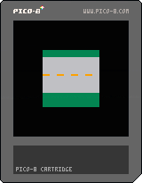
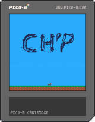
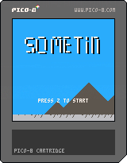

# GameDevBootcamp
Exploring Math and Programming by making games in PICO-8

## Office Hours Tips 'n Tricks:
Every week we tried to let the attendees vote on a topic they'd like to learn during office hours.

### Week 1: [Outlines and Screenshakes](tips_n_tricks/week1/week1.md)
### Week 2: [Wavy Effects](tips_n_tricks/week2/week2.md)
### Week 3: [More than 2 Frame Animations, Sublime Text, and Map Collisions!](tips_n_tricks/week3/week3.md)

## Bootcamp Example Carts
We covered some extra miscellaneous topics as they came up. Here are some carts that illustrate those topics:  

- #### Screen Transition

- #### Acceleration / Gravity

- #### Game States
