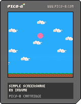

# Tips 'n Tricks Week 1
1. **Sprite / Text Outlines** (Tied!)
2. ~~Centered Waving Text~~
3. **Simple Screenshake** (Tied!)

## 1. Drawing Outlines

Check out the tutorial in the `_draw` function.  
  
- [Using Pal](http://pico-8.wikia.com/wiki/Pal)

## 2. Simple Screenshake

And here's a simple Screenshake tutorial.  
  
- [Using Camera](http://pico-8.wikia.com/wiki/Camera)

### Resources

There's a lot more you can do with screenshakes and outlines.  
Check out the [#pico8](https://twitter.com/search?q=%23pico8) hashtag on twitter or search through the [bbs](https://www.lexaloffle.com/bbs/) for tutorials and games that use them.

A lot of [TRASEVOL_DOG](https://twitter.com/TRASEVOL_DOG)'s stuff uses screenshake and outlines abundantly. Here's [one of his games](https://www.lexaloffle.com/bbs/?tid=28202) as an example.