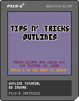

# Tips 'n Tricks Week 1
1. **Sprite / Text Outlines** (Tied!)
2. ~~Centered Waving Text~~
3. **Simple Screenshake** (Tied!)

## 1. Drawing Outlines

Check out the tutorial in the `_draw` function.  
  
- [Using Pal](http://pico-8.wikia.com/wiki/Pal)

## 2. Simple Screenshake