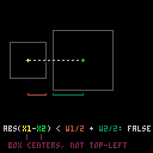
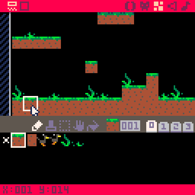
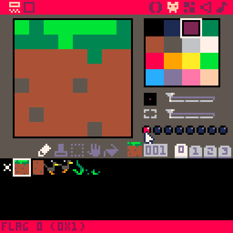
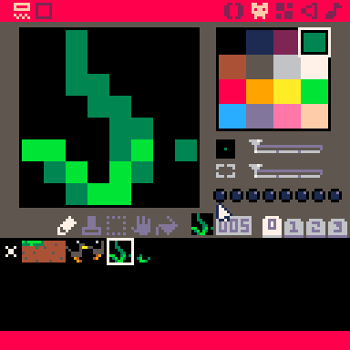
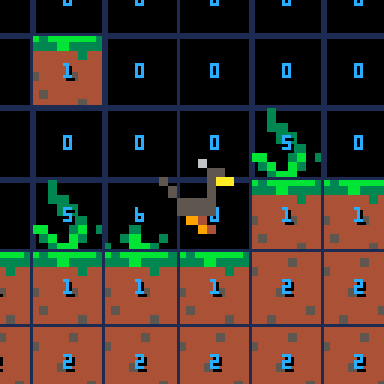
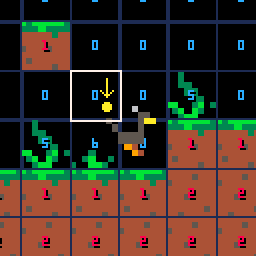
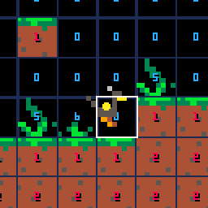
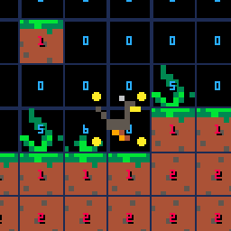

# Map Collisions

## Review

So quick review on collisions, we've covered:

1. distance < half widths  
. 
2. standard box-box collision (AABB)
(gif coming soon)
3. The pixel perfect [Duck Hunt](https://www.youtube.com/watch?v=-1NyIsZXeqU)-style detection (gif coming soon)

\* here's [a cart (coming soon)](#) that the above gifs came from

## Map Collisions

Now how about colliding with what we have drawn on the map?  
We could check each moving object against each map sprite and do box-box collision on the two, but that'd be a lot of checks!  

PICO-8 has some convenient functions that let us do collisions with the map a little more easily.  
These functions are:

### [`mget(cellx, celly)`](http://pico-8.wikia.com/wiki/Mget)

`mget` gives us the sprite number given x and y coordinates.
Notice though, we need to give it x and y **cell coordinates**. That refers to the x and y coordinates on the bottom left of the map editor when you hover over a sprite on the map.



`mget` returns the sprite number given the cell x and y coordinates, so `mget(1, 14)` would give us `1` in the picture above, because the sprite at coordinate (1,14) is 1.

Because each cell coordinate refers to 1 sprite and each sprite is 8x8 pixels, the sprite that the mouse is pointed at in the above picture would be at the **pixel coordinates** of (8, 112) or (**1 x 8**, **14 x 8**).


### [`fget(n, f)`](http://pico-8.wikia.com/wiki/Fget)

Now that we know what sprite is at a particular x and y coordinate, we can check if that sprite has a flag set.   
**Sprite flags** are those little circles below the color and size pickers in the Sprite Editor.



The sprite selected in the above picture has **flag 0** turned on.
If we look at [the documentation](http://pico-8.wikia.com/wiki/Fget), we see that `fget(n, f)` takes a sprite number first and then the flag number second, returning `true` or `false` depending on if the flag is set. 
That means to get the flag for the sprite in the above picture, we'd do `fget(1, 0)`, looking at sprite number 1 to see if flag 0 is set.

Flags can be used any way you'd like but in the case of our map collisions, we can say "if a sprite has flag 0 turned on, the player can't go through it. It's a solid object."

That way we can use sprites with flag 0 for solid terrain and sprites without flag 0 as non-colliding parts of the background.



*Sprite 5's flag 0 is off. That means the player can walk through it.*

## Putting it all together

### 1. `mget`
Using `mget`, we can get the sprite number of each sprite on the map. I've drawn the output of `mget` on the actual sprites here so we can see them easier.



### 2. `fget`

Now if we use `fget` with those sprite numbers, we'll be able to tell if that place on the map is "solid" or not. I've colored the sprite numbers <span style="color:red;">red</span> if their flag 0 is on.

   
\* Notice, the grasses' sprite numbers aren't red

### 3. Player Location

Alright, that's great and all but we don't need every sprite and every flag on the map, we just need to know the sprite and flag that the character is on so that we can tell if she's colliding or not.

How do we do that though? Our character's x and y coordinates represent pixels, but `mget` takes x and y map cell coordinates!

The Player's x and y coordinates on the screen can be anywhere on the screen, that's 128x128, but the map's x and y cell coordinates count the sprites, not the pixels. If we cut the screen into chunks of 8 pixels each, each one of those 8x8 chunks is a sprite and is one cell coordinate. In order to *divide* something into chunks... we **divide** it! So 128px / 8px per sprite == **16 sprites**. Our screen can only hold 16x16 sprites. 

We can use that same calculation to figure out which map cell our character is on.
Let's say our character is at (18, 64), if we divide those by 8, we get (18/8, 64/8) == (**2.25**, **8**). `mget` knows that when we say 2.25, we mean 2, so we don't need to worry about giving it decimals. How convenient! That means (18, 64) is at cell (2, 8). Now we just plug that into `mget` and `fget` and we can now tell if a character is on a solid sprite!

But we have a slight problem..

  
\* *watch the yellow circle*

Our we're using the top left point of our character's sprite!
Ok, easy enough, we'll just use the middle instead (`p.x + p.w/2` and `p.y + p.h/2`).. But wait..



It's a little bit better now, but our character is ***still*** going inside the solid sprites a little bit before we detect the collision. What we should do instead is check every corner to see if there's a collision!



There we go! Now if any of those corners is on a solid map cell, we know that our character is colliding with it!

### Summary

Putting that all together in code might look something like this:

```lua
mx = p.x/8
my = p.y/8
mw = p.w/8 -- character's width in map cells
mh = p.h/8 -- and height

if fget(mget(mx,   my),    0) or   -- top left
   fget(mget(mx+mw,my),    0) or   -- top right
   fget(mget(mx,   my+mh), 0) or   -- bottom left
   fget(mget(mx+mw,my+mh), 0) then -- bottom right
 -- react to the collision
else
 -- do other stuff when we don't collide
end
```

A common way to handle collision reactions is to just not go there or turn around instead!  
Something like this:
```lua
mx = p.x/8
my = p.y/8
mw = p.w/8 -- character's width in map cells
mh = p.h/8 -- and height

next_mx = (p.x+p.dx)/8
next_my = (p.y+p.dy)/8

-- try move on the x axis
if fget(mget(next_mx,   my),    0) or   -- top left
   fget(mget(next_mx+mw,my),    0) or   -- top right
   fget(mget(next_mx,   my+mh), 0) or   -- bottom left
   fget(mget(next_mx+mw,my+mh), 0) then -- bottom right
 p.dx = -p.dx * .4  -- face the other way and dampen the bounce
else
 p.x += p.dx  -- it's safe to move
end

-- try move on the y axis
if fget(mget(mx,   next_my),    0) or   -- top left
   fget(mget(mx+mw,next_my),    0) or   -- top right
   fget(mget(mx,   next_my+mh), 0) or   -- bottom left
   fget(mget(mx+mw,next_my+mh), 0) then -- bottom right
 p.dy = -p.dy * .4  -- face the other way and dampen the bounce
else
 p.y += p.dy -- it's safe to move
end
```

There we go, we got a solid map that our character can walk around in!


## That's It!

\* This will be updated soon with a review cart as well as a simplified working map collision cart. 

